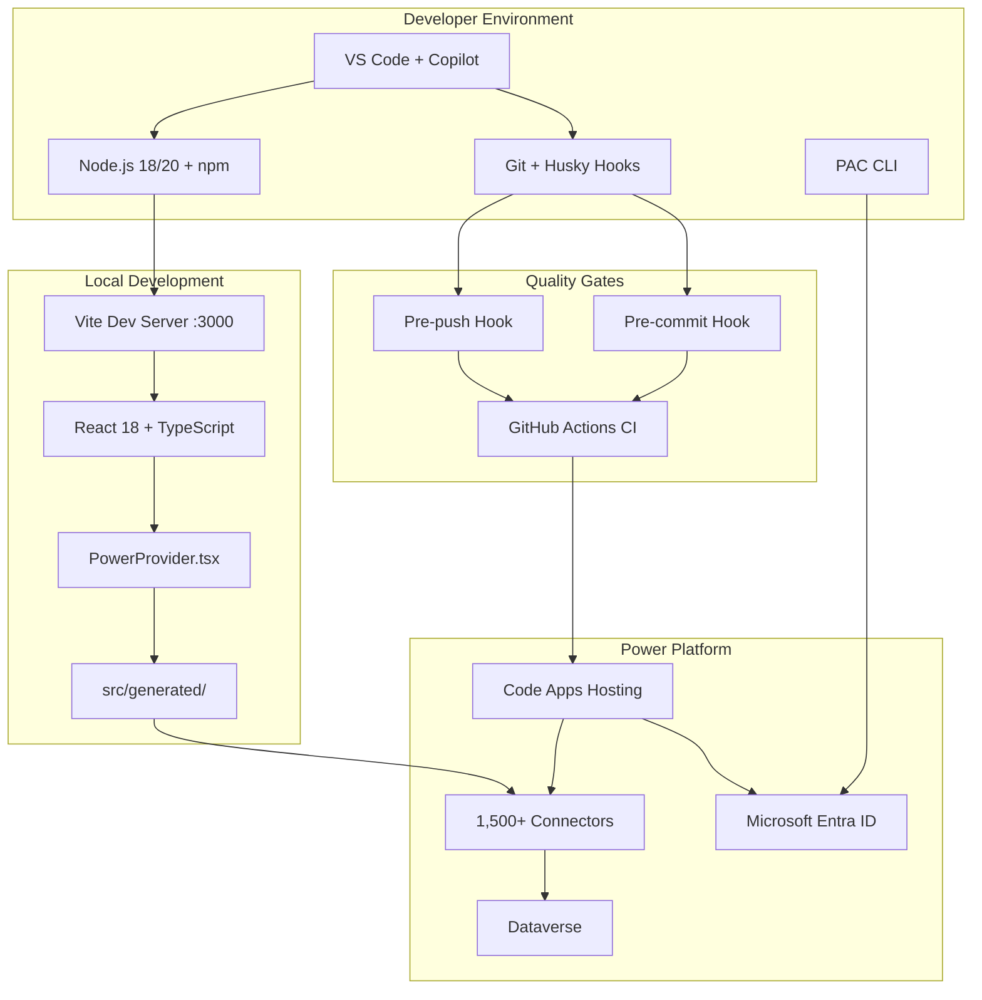
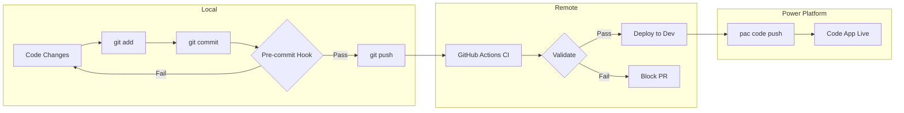
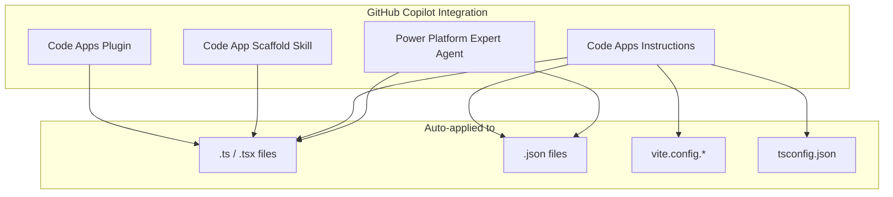

# Power Apps Code Apps - GitHub Copilot Guide for VS Code

> **Primary Purpose**: This repository provides a complete **GitHub Copilot configuration guide for Visual Studio Code** tailored for **Microsoft Power Apps Code Apps** development.

A comprehensive collection of best practices, configurations, and tooling for **Microsoft Power Apps Code Apps** development, designed to be used as a **GitHub Copilot workspace configuration** in VS Code.

## 🎯 Primary Goal

**Configure GitHub Copilot in VS Code** with specialized knowledge for Power Apps Code Apps development, including:

- **Custom Instructions** - Auto-applied coding standards for `.ts`, `.tsx`, `.json`, `vite.config.*`, `tsconfig.json`
- **Specialized Agent** - `Power Platform Expert` agent for Code Apps guidance
- **Scaffolding Skill** - `power-apps-code-app-scaffold` for project initialization
- **Plugin** - `power-apps-code-apps` toolkit for Copilot
- **Quality Gates** - Pre-commit/pre-push hooks + CI/CD pipeline

## 📋 Overview

This repository provides everything you need to build high-quality Power Apps Code Apps following Microsoft's official guidelines:

- **Development Standards** - TypeScript, React, and Power Platform SDK best practices
- **Project Scaffolding** - Complete project structure with PAC CLI integration
- **Git Hooks** - Pre-commit/pre-push validation with Husky + lint-staged
- **CI/CD Pipeline** - GitHub Actions workflow for validation and deployment
- **VS Code Integration** - Copilot instructions, agents, and skills for AI-assisted development

## 🏗️ Architecture Overview



## 🚀 Quick Start

### For New Projects

```bash
# 1. Use Microsoft's official starter template
npx degit microsoft/PowerAppsCodeApps/templates/starter my-code-app
cd my-code-app

# 2. Install dependencies
npm install

# 3. Copy best practices configuration
# Copy .github/ folder contents to your project root
# Or clone this repo and copy the files you need

# 4. Install git hooks
npm run prepare  # Runs: husky install

# 5. Start development
npm run dev  # Runs on port 3000 (required)
```

### For Existing Projects

```bash
# 1. Copy configuration files to your project
cp -r path/to/this/repo/.github/* .github/

# 2. Install required dev dependencies
npm install --save-dev husky lint-staged prettier \
  @typescript-eslint/parser @typescript-eslint/eslint-plugin \
  eslint-plugin-react-hooks eslint-plugin-react-refresh

# 3. Add scripts to package.json (see SETUP.md)

# 4. Initialize hooks
npm run prepare
```

## 📁 Repository Structure

```
.github/
├── copilot-instructions.md           # GitHub Copilot configuration
├── agents/
│   └── power-platform-expert.agent.md  # AI agent for Code Apps guidance
├── instructions/
│   └── power-apps-code-apps.instructions.md  # Development standards
├── skills/
│   └── power-apps-code-app-scaffold/
│       └── SKILL.md                  # Project scaffolding skill
├── plugins/
│   └── power-apps-code-apps/
│       └── README.md                 # Copilot plugin definition
├── husky-hooks/
│   ├── pre-commit                    # Pre-commit validation hook
│   ├── pre-push                      # Pre-push validation hook
│   ├── eslint.config.js              # ESLint flat config
│   └── .prettierrc                   # Prettier configuration
├── workflows/
│   └── validate.yml                  # GitHub Actions CI/CD pipeline
└── power-apps-code-apps-precommit-hooks.md  # Complete hooks documentation

docs/
├── SETUP.md                          # Detailed setup guide
├── BEST_PRACTICES.md                 # Development best practices
├── GIT_HOOKS.md                      # Git hooks reference
├── CI_CD.md                          # CI/CD pipeline guide
├── PAC_CLI.md                        # PAC CLI commands reference
└── TROUBLESHOOTING.md                # Common issues and solutions
```

## ✨ Key Features

### Development Standards
- TypeScript strict mode with `verbatimModuleSyntax: false`
- React 18+ with functional components and hooks
- Vite bundler with `base: "./"` for Power Platform deployment
- Port 3000 requirement for local development
- PowerProvider pattern for Power Platform initialization

### Code Quality Gates
- **Pre-commit**: ESLint + Prettier + TypeScript + Build + Code Apps config validation
- **Pre-push**: Full validation suite + PAC CLI authentication check
- **CI/CD**: Automated validation on every push/PR

## 🔄 Development Workflow



## 📁 Repository Structure

### Supported Connectors (Official)

| Connector | Description |
|-----------|-------------|
| **SQL Server / Azure SQL** | Full CRUD operations, stored procedures |
| **SharePoint** | Document libraries, lists, and sites |
| **Office 365 Users & Groups** | Profile information, group memberships |
| **Azure Data Explorer** | Analytics and big data queries |
| **OneDrive for Business** | File storage and sharing |
| **Microsoft Teams** | Team collaboration and notifications |
| **Dataverse** | Full CRUD, relationships, business logic |

## 📚 Documentation

| Guide | Description |
|-------|-------------|
| [SETUP.md](docs/SETUP.md) | Complete installation and configuration |
| [BEST_PRACTICES.md](docs/BEST_PRACTICES.md) | Development standards and patterns |
| [GIT_HOOKS.md](docs/GIT_HOOKS.md) | Git hooks configuration and customization |
| [CI_CD.md](docs/CI_CD.md) | GitHub Actions pipeline setup |
| [PAC_CLI.md](docs/PAC_CLI.md) | PAC CLI commands and workflows |
| [TROUBLESHOOTING.md](docs/TROUBLESHOOTING.md) | Common issues and solutions |

## 🤖 AI-Assisted Development

This repository includes GitHub Copilot customizations:



- **Agent**: `Power Platform Expert` - Specialized in Code Apps
- **Instructions**: Auto-applied to `.ts`, `.tsx`, `.json`, `vite.config.*`, `tsconfig.json`
- **Skill**: `power-apps-code-app-scaffold` - Project scaffolding
- **Plugin**: `power-apps-code-apps` - Complete toolkit

## 🔧 Requirements

- **Node.js**: LTS (v18.x or v20.x)
- **Power Platform CLI**: Latest version
- **Power Apps Premium**: Per-user license for end users
- **VS Code**: With Power Platform Tools extension (recommended)
- **Git**: For version control and hooks

## 📖 References

- [Power Apps Code Apps Documentation](https://learn.microsoft.com/en-us/power-apps/developer/code-apps/)
- [Official Samples Repository](https://github.com/microsoft/PowerAppsCodeApps)
- [Power Platform CLI Reference](https://learn.microsoft.com/en-us/power-platform/developer/cli/reference)
- [Awesome GitHub Copilot](https://awesome-copilot.github.com/)

## 📚 Sources

The content in this repository is based on the following sources:

| Source | Description | Link |
|--------|-------------|------|
| **Microsoft Power Apps Code Apps** | Official documentation, SDK, templates, and samples | [github.com/microsoft/PowerAppsCodeApps](https://github.com/microsoft/PowerAppsCodeApps) |
| **Microsoft Learn - Code Apps** | Development standards, architecture, system limits | [learn.microsoft.com](https://learn.microsoft.com/en-us/power-apps/developer/code-apps/) |
| **Microsoft Power Platform CLI** | PAC CLI reference and authentication guide | [learn.microsoft.com](https://learn.microsoft.com/en-us/power-platform/developer/cli/reference) |
| **Awesome GitHub Copilot** | Community-driven GitHub Copilot extensions gallery | [awesome-copilot.github.com](https://awesome-copilot.github.com/) |
| **Husky** | Git hooks manager for Node.js | [typicode.github.io/husky](https://typicode.github.io/husky/) |
| **lint-staged** | Run linters against staged git files | [github.com/okonet/lint-staged](https://github.com/okonet/lint-staged) |
| **ESLint** | Pluggable JavaScript linter | [eslint.org](https://eslint.org/) |
| **Prettier** | Opinionated code formatter | [prettier.io](https://prettier.io/) |
| **Vite** | Next generation frontend tooling | [vite.dev](https://vite.dev/) |
| **Fluent UI React** | Microsoft's official React component library | [react.fluentui.dev](https://react.fluentui.dev/) |

### Specific Resource Attribution

- **Power Platform Expert Agent** — Adapted from the [Awesome Copilot Power Platform Expert agent](https://awesome-copilot.github.com/agent/power-platform-expert/)
- **Code Apps Instructions** — Based on the [Awesome Copilot Power Apps Code Apps instructions](https://awesome-copilot.github.com/instructions/power-apps-code-apps/)
- **Code App Scaffold Skill** — Derived from the [Awesome Copilot Power Apps Code App Scaffold skill](https://awesome-copilot.github.com/skill/power-apps-code-app-scaffold/)
- **Code Apps Plugin** — Based on the [Awesome Copilot Power Apps Code Apps plugin](https://awesome-copilot.github.com/plugin/power-apps-code-apps/)
- **Pre-commit Hooks Configuration** — Custom implementation based on Power Apps SDK requirements from [Microsoft Power Apps SDK (@microsoft/power-apps)](https://www.npmjs.com/package/@microsoft/power-apps)
- **GitHub Actions Pipeline** — Based on [PAC CLI deployment patterns](https://learn.microsoft.com/en-us/power-platform/developer/cli/reference/code) from Microsoft Learn

## 📄 License

MIT License - Feel free to use, modify, and distribute.

## 🤝 Contributing

See [CONTRIBUTING.md](CONTRIBUTING.md) for guidelines on contributing to this repository.

---

**Maintained by the Power Platform community** | Based on Microsoft official guidelines and samples